# TaskCloud

## Description

TaskCloud is a mobile application built with React Native and Expo. It is a ToDo application that integrates with a weather API to provide weather information for the location of each task. The application supports user authentication with roles, where only users with the admin role can create, edit, or delete tasks.

## Technologies used
- React Native
- Node.js
- Express.js for local database
- Axios
- NativeWind
- Day.js
- AsyncStorage
- Expo

## Features

- User Authentication (Login, Logout)
- Role-Based Access Control (Admin and User roles)
- Create, Edit, Delete tasks (Admin only)
- View task list (tap task to edit and see details)
- Weather integration for task locations
- Temperature unit toggle (Celsius and Fahrenheit)
- Caching of weather data to reduce API requests

## Installation

Clone the repository:

```bash
git clone https://github.com/yourusername/taskcloud.git
cd taskcloud
```

Install dependencies for the mobile app:

```bash
npm install
```

Install dependencies for the server:

```bash
cd api-server
npm install
```

## Configuration

### Configuration File

Create a `config.js` file in the root directory and add the following:

```bash
module.exports = {
  BACKEND_URL: "http://<your-iPv4-address>:3000", // Update with your address
  SECRET_KEY: "b51527662ffa7e453eb2d54a9fafc5fc44295441676a730b956d4f66d57ad0b8", // You can keep this key or replace with your own secure secret key for JWT authentication
  WEATHER_API_KEY: "your_openweathermap_api_key", // Replace with your OpenWeatherMap API key
};
```
### Mobile App

- The mobile app uses Expo Go for development. Ensure your mobile device and computer are on the same network.
- Install the Expo Go app on your mobile device.

## Usage

### Running the server

Start the server:

```bash
cd api-server
node server.js
```

### Running the mobile app

Start the mobile app:

```bash
npx expo start
```

Follow the instructions to run the app on an emulator or a physical device using the Expo Go app.

## Default users

Use the following credentials to log in:

### Admin user:
- Email: `admin@mail.com`
- Password: `admin123`

### Regular user:
- Email: `user@mail.com`
- Password: `user123`


## API Documentation

### Endpoints

- `POST /login` - Login a user and obtain a JWT token
- `GET /profile` - Get the authenticated user's profile
- `GET /tasks` - Get all tasks (authentication required)
- `POST /tasks` - Create a new task (admin only)
- `PUT /tasks/:id` - Update a task (admin only)
- `DELETE /tasks/:id` - Delete a task (admin only)

## Previews

### Onboarding screen
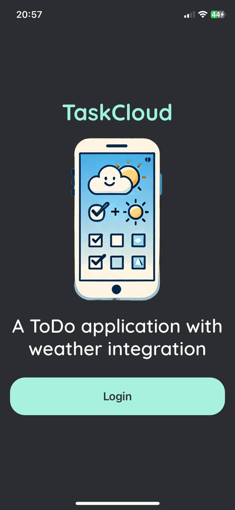

### Sign in screen
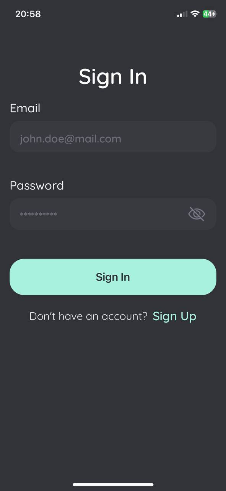

### Task list (admin)
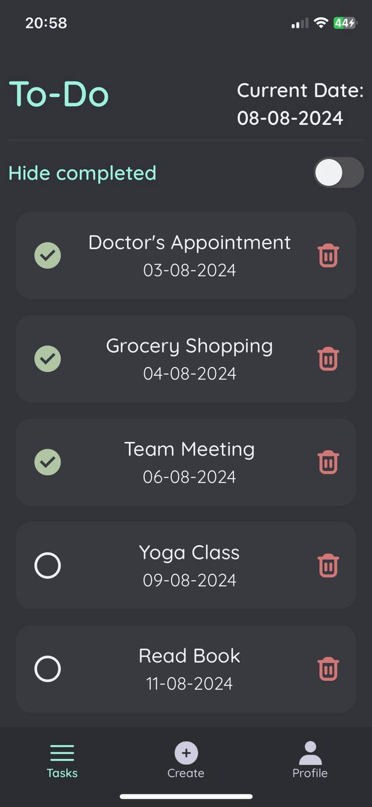

### Task details (admin, celcius)
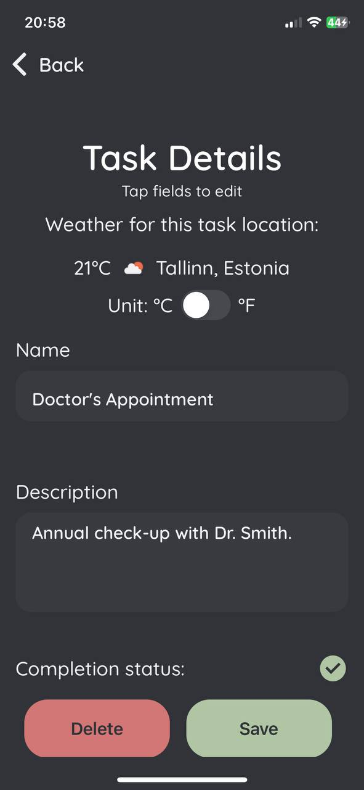

### Task details (admin, fahrenheit)
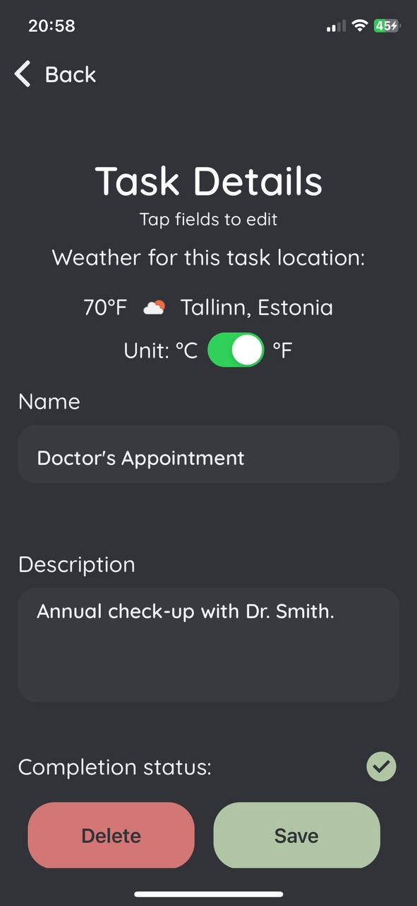

### Create task (admin)
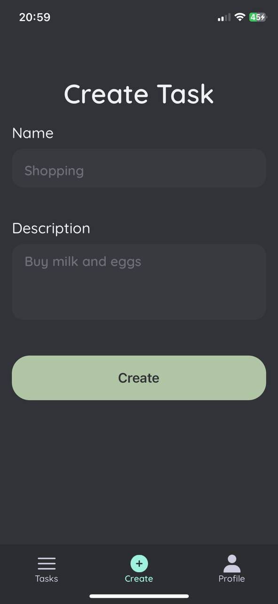

### Profile
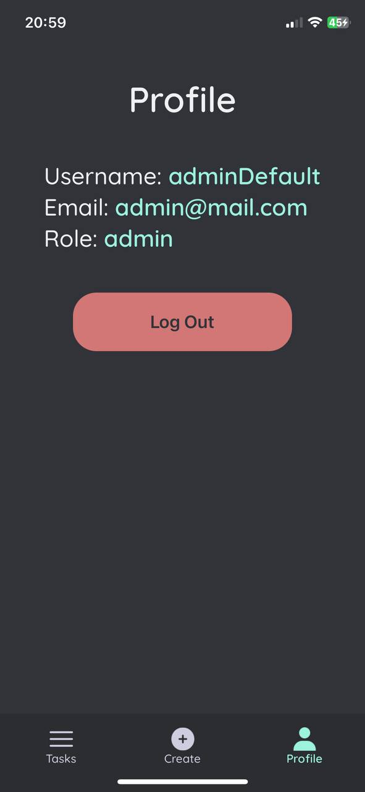

### Task list (user)
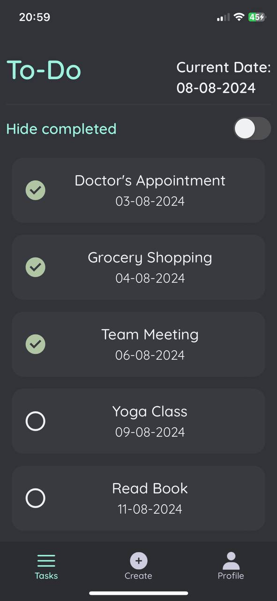

### Task list (user, hide completed)
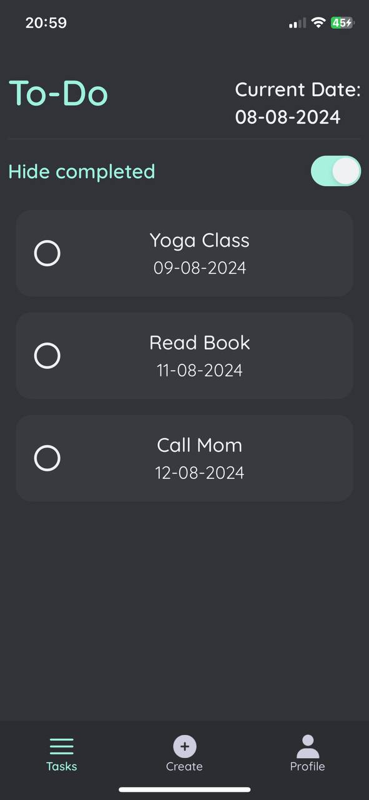

### Task details (user)
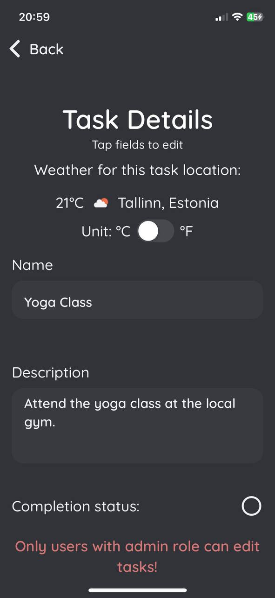

### Create task (user)
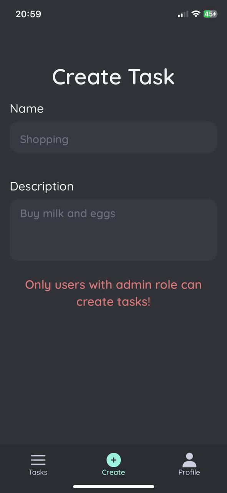

## License

This project is licensed under the MIT License.